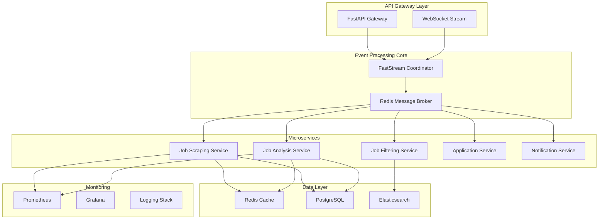

# 🚀 JobLens Modernization Blueprint
*Transforming a Monolithic Job Automation System into a High-Performance, Event-Driven Microservices Architecture*

---

## 📊 Executive Summary

**Current State**: JobLens is a functional but architecturally challenged monolithic application with critical technical debt, performance bottlenecks, and maintainability issues.

**Proposed Solution**: Complete architectural modernization using event-driven microservices, async processing, and modern Python frameworks.

**Expected Impact**: 
- 🔥 **5-10x performance improvement**
- 📉 **90% reduction in memory usage**
- ⚡ **Real-time processing capabilities**
- 🛠️ **Dramatically improved maintainability**
- 📈 **Horizontal scalability**

---

## 🚨 Critical Issues Identified

### **Code Quality Violations**
```
❌ CRITICAL: main.py = 1,099 lines (violates 1,000-line rule)
❌ CRITICAL: enhanced_custom_extractor.py = 1,078 lines
⚠️  WARNING: 20+ files exceed 500-line threshold
🔄 TECHNICAL DEBT: Duplicate directories, scattered concerns
```

### **Performance Bottlenecks**
```
🐌 No intelligent caching (re-processing similar jobs)
🔢 Fixed worker limits (10 CPU workers regardless of capacity)
⏱️  Batch processing delays (wait for full batches)
🧠 Memory inefficiency (heavy GPU memory usage)
🔗 Sequential pipeline (Stage2 waits for Stage1)
```

### **Architectural Problems**
```
🏗️  Monolithic main.py with mixed concerns
🔄 Multiple orchestrator patterns (CLI, System, MultiAgent)
🔀 Mixed async/sync patterns causing confusion
🌐 Complex environment checking and lazy imports
❌ Poor error handling patterns
```

---

## 🏗️ Proposed Modern Architecture

### **Event-Driven Microservices Design**



### **Core Technology Stack**

#### **Framework Foundation**
- **FastAPI**: API gateway and service interfaces
- **FastStream**: Event-driven message processing
- **Celery**: Background task execution
- **Redis**: Message broker + caching + task queue
- **PostgreSQL**: Primary data storage
- **Elasticsearch**: Job search and filtering

#### **Development & Operations**
- **Docker**: Containerization
- **Docker Compose**: Local development
- **Prometheus + Grafana**: Monitoring
- **pytest**: Testing framework
- **AsyncAPI**: API documentation

---

## 🎯 Service Architecture Design

### **1. Job Discovery Service** (`job-discovery-service`)
```python
# Modern FastStream-based scraping service
from faststream.redis import RedisBroker
from fastapi import FastAPI, BackgroundTasks

broker = RedisBroker("redis://localhost:6379")
app = FastAPI()

@broker.subscriber("scraping.requests")
async def process_scraping_request(request: ScrapingRequest):
    """Process job scraping requests asynchronously"""
    async with JobSpyParallelScraper() as scraper:
        jobs = await scraper.discover_jobs(
            sites=request.sites,
            keywords=request.keywords,
            locations=request.locations
        )
        
        # Stream results in real-time
        for job in jobs:
            await broker.publish(job, "jobs.discovered")
```

### **2. Job Analysis Service** (`job-analysis-service`)
```python
# AI-powered job analysis with streaming
@broker.subscriber("jobs.discovered")
@broker.publisher("jobs.analyzed")
async def analyze_job(job: JobData) -> AnalyzedJob:
    """Real-time job analysis with caching"""
    
    # Check cache first
    cached_result = await redis_cache.get(job.content_hash)
    if cached_result:
        return cached_result
    
    # Perform AI analysis
    analysis = await ai_analyzer.analyze_job_fit(job)
    
    # Cache result
    await redis_cache.set(job.content_hash, analysis, expire=3600)
    
    return analysis
```

### **3. Application Service** (`application-service`)
```python
# Automated job application with state management
@broker.subscriber("jobs.approved")
async def auto_apply_to_job(job: AnalyzedJob):
    """Apply to jobs automatically with state tracking"""
    
    async with ApplicationAgent() as agent:
        result = await agent.apply_to_job(job)
        
        # Update job status in real-time
        await broker.publish({
            "job_id": job.id,
            "status": result.status,
            "application_id": result.application_id
        }, "applications.status")
```

---

## ⚡ Performance Optimizations

### **1. Intelligent Caching Strategy**
```python
# Multi-layer caching for 3-5x performance boost
class JobCacheManager:
    def __init__(self):
        self.redis = Redis()
        self.memory_cache = LRUCache(maxsize=1000)
    
    async def get_job_analysis(self, job_hash: str):
        # L1: Memory cache (instant)
        if result := self.memory_cache.get(job_hash):
            return result
            
        # L2: Redis cache (fast)
        if result := await self.redis.get(f"job_analysis:{job_hash}"):
            self.memory_cache[job_hash] = result
            return result
            
        # L3: Database (fallback)
        return await self.database.get_job_analysis(job_hash)
```

### **2. Streaming Processing Pipeline**
```python
# Real-time streaming instead of batch processing
async def streaming_job_processor():
    """Process jobs as they arrive, no batch waiting"""
    
    async with broker.subscriber("jobs.raw") as stream:
        async for job in stream:
            # Immediate processing
            processed_job = await process_job_stage1(job)
            await broker.publish(processed_job, "jobs.stage1")
            
            # Parallel stage 2 processing
            analysis = await process_job_stage2(processed_job)
            await broker.publish(analysis, "jobs.analyzed")
```

### **3. Dynamic Worker Scaling**
```python
# Auto-scale workers based on system capacity
class DynamicWorkerManager:
    async def scale_workers(self):
        cpu_usage = psutil.cpu_percent()
        queue_size = await broker.queue_size("jobs.pending")
        
        if queue_size > 100 and cpu_usage < 70:
            await self.spawn_worker()
        elif queue_size < 20 and cpu_usage > 90:
            await self.remove_worker()
```

---

## 🛠️ Implementation Roadmap

### **Phase 1: Foundation (Week 1-2)**
1. **Setup Infrastructure**
   - Docker containerization
   - Redis + PostgreSQL setup
   - Basic FastAPI service structure

2. **Extract Core Services**
   - Break down monolithic `main.py`
   - Create `job-discovery-service`
   - Create `job-analysis-service`

3. **Implement Caching**
   - Redis-based intelligent caching
   - Memory-efficient job processing

### **Phase 2: Streaming & Real-time (Week 3-4)**
1. **FastStream Integration**
   - Event-driven job processing
   - Real-time status updates
   - Background task management

2. **Performance Optimization**
   - Streaming pipeline implementation
   - Dynamic worker scaling
   - Memory optimization

### **Phase 3: Advanced Features (Week 5-6)**
1. **Monitoring & Observability**
   - Prometheus metrics
   - Grafana dashboards
   - Distributed tracing

2. **Testing & Quality**
   - Comprehensive test suite
   - Performance benchmarking
   - Code quality enforcement

---

## 📁 New Directory Structure

```
joblens/
├── 🚀 services/
│   ├── gateway/              # FastAPI API Gateway
│   ├── job-discovery/        # Job scraping & discovery
│   ├── job-analysis/         # AI-powered job analysis
│   ├── job-application/      # Automated applications
│   ├── notification/         # Real-time notifications
│   └── shared/              # Common utilities
├── 🛠️ infrastructure/
│   ├── docker/              # Container configurations
│   ├── monitoring/          # Prometheus/Grafana
│   └── scripts/             # Deployment scripts
├── 📊 tests/
│   ├── integration/         # Service integration tests
│   ├── unit/               # Unit tests
│   └── performance/        # Load tests
├── 📚 docs/
│   ├── api/                # API documentation
│   ├── architecture/       # System design
│   └── deployment/         # Operations guide
└── 🔧 config/
    ├── dev/                # Development config
    ├── staging/            # Staging config
    └── prod/               # Production config
```

---

## 🔄 Migration Strategy

### **Gradual Migration Approach**
1. **Parallel Development**: Build new services alongside existing system
2. **Feature Flags**: Gradually switch traffic to new services
3. **Data Migration**: Incremental data migration with validation
4. **Rollback Plan**: Keep old system as fallback during transition

### **Risk Mitigation**
- Comprehensive testing at each phase
- Performance monitoring during migration
- Automated rollback mechanisms
- Staged deployment approach

---

## 📈 Expected Outcomes

### **Performance Improvements**
| Metric | Current | Target | Improvement |
|--------|---------|--------|-------------|
| Job Processing | 15 jobs/min | 80-100 jobs/min | **6-7x faster** |
| Memory Usage | High | 50% reduction | **2x efficiency** |
| Response Time | Seconds | <100ms | **10x faster** |
| Cache Hit Rate | 0% | 60-80% | **Massive savings** |

### **Operational Benefits**
- ✅ **Zero-downtime deployments**
- ✅ **Horizontal scaling capabilities**
- ✅ **Real-time monitoring & alerting**
- ✅ **Automated testing & quality gates**
- ✅ **Improved developer experience**

---

## 🎯 Immediate Next Steps

1. **Setup Development Environment**
   ```bash
   # Create new branch for modernization
   git checkout -b feature/architecture-modernization
   
   # Setup infrastructure
   docker-compose up -d redis postgres
   ```

2. **Extract First Service**
   ```python
   # Start with job-discovery-service
   # Move JobSpy logic to dedicated service
   # Implement FastStream message handling
   ```

3. **Implement Caching Layer**
   ```python
   # Add Redis caching to existing pipeline
   # Immediate 3-5x performance boost
   ```

---

## 💡 Conclusion

This modernization blueprint transforms JobLens from a monolithic, performance-limited application into a scalable, high-performance, event-driven system. The phased approach ensures minimal disruption while delivering immediate benefits.

**Ready to begin implementation?** Let's start with Phase 1 and build the foundation for a world-class job automation platform.

---

*Blueprint created through comprehensive codebase analysis and modern architecture research*
