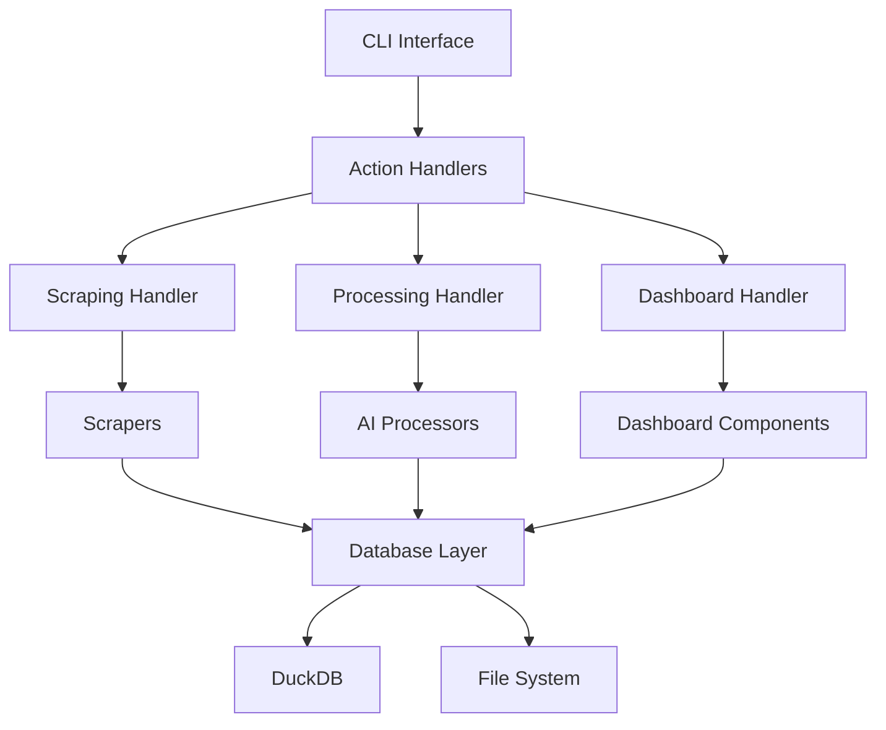

# JobQst System Architecture

**Version**: 2.0.0  
**Last Updated**: September 21, 2025

This document provides a comprehensive overview of JobQst's system architecture, design patterns, and technical decisions following modern Python development standards.

## Table of Contents

- [System Overview](#system-overview)
- [Core Architecture](#core-architecture)
- [Data Flow](#data-flow)
- [Component Design](#component-design)
- [Database Architecture](#database-architecture)
- [Processing Pipeline](#processing-pipeline)
- [Security Architecture](#security-architecture)
- [Performance Considerations](#performance-considerations)
- [Deployment Architecture](#deployment-architecture)

## System Overview

JobQst is designed as a modular, scalable job search automation platform with clear separation of concerns and modern Python architectural patterns.

### Design Principles

1. **Separation of Concerns**: Each module has a single, well-defined responsibility
2. **Type Safety**: Comprehensive type annotations throughout the codebase
3. **Async-First**: Asynchronous operations for I/O-bound tasks
4. **Dependency Injection**: Configurable components with clear interfaces
5. **Error Resilience**: Graceful degradation and comprehensive error handling
6. **Performance**: Optimized for both speed and resource efficiency

### High-Level Architecture

```
┌─────────────────────────────────────────────────────────────────┐
│                        JobQst Platform                          │
├─────────────────────────────────────────────────────────────────┤
│  Presentation Layer                                             │
│  ┌─────────────────┐  ┌─────────────────┐  ┌─────────────────┐ │
│  │   CLI Interface │  │     Dashboard   │  │   REST API      │ │
│  │   (main.py)     │  │   (Dash/Plotly) │  │   (FastAPI)     │ │
│  └─────────────────┘  └─────────────────┘  └─────────────────┘ │
├─────────────────────────────────────────────────────────────────┤
│  Business Logic Layer                                           │
│  ┌─────────────────┐  ┌─────────────────┐  ┌─────────────────┐ │
│  │   Job Scrapers  │  │   AI Processing │  │   Analytics     │ │
│  │   (Multi-site)  │  │   (GPU/CPU)     │  │   (Aggregation) │ │
│  └─────────────────┘  └─────────────────┘  └─────────────────┘ │
├─────────────────────────────────────────────────────────────────┤
│  Data Layer                                                     │
│  ┌─────────────────┐  ┌─────────────────┐  ┌─────────────────┐ │
│  │   DuckDB        │  │   File Cache    │  │   Session Store │ │
│  │   (Analytics)   │  │   (HTML/JSON)   │  │   (JSON)        │ │
│  └─────────────────┘  └─────────────────┘  └─────────────────┘ │
└─────────────────────────────────────────────────────────────────┘
```

## Core Architecture

### Module Structure

```
src/
├── core/                      # Core business logic
│   ├── job_database.py       # Database abstraction layer
│   ├── duckdb_database.py    # DuckDB implementation
│   ├── smart_deduplication.py # Duplicate detection
│   ├── job_filters.py        # Relevance filtering
│   └── exceptions.py         # Custom exceptions
├── scrapers/                  # Web scraping components
│   ├── base_scraper.py       # Abstract base class
│   ├── unified_eluta_scraper.py # Eluta integration
│   ├── external_job_scraper.py  # External sites
│   └── enhanced_job_description_scraper.py # Job details
├── analysis/                  # AI processing pipeline
│   ├── two_stage_processor.py # Main processing engine
│   └── custom_data_extractor.py # Data extraction
├── dashboard/                 # Web dashboard
│   ├── unified_dashboard.py  # Main dashboard app
│   └── dash_app/            # Dashboard components
├── cli/                      # Command line interface
│   ├── menu/                # Interactive menus
│   ├── actions/             # Action handlers
│   └── handlers/            # Business logic handlers
└── utils/                    # Shared utilities
    ├── profile_helpers.py   # Profile management
    ├── intelligent_search_generator.py # Keyword generation
    └── logging.py           # Logging configuration
```

### Dependency Graph



## Data Flow

### Job Discovery Flow

```
1. User Input
   ├── Profile Keywords
   ├── Location Preferences
   └── Experience Level
   
2. Scraping Pipeline
   ├── Eluta Scraper (Canadian focus)
   ├── External Scrapers (Global)
   └── Rate Limiting & Anti-bot
   
3. Data Processing
   ├── Smart Deduplication (85% accuracy)
   ├── Relevance Filtering (90% precision)
   └── Data Normalization
   
4. AI Analysis
   ├── Stage 1: Fast CPU Processing
   ├── Stage 2: GPU-accelerated Analysis
   └── Compatibility Scoring
   
5. Storage & Analytics
   ├── DuckDB Columnar Storage
   ├── Real-time Analytics
   └── Dashboard Updates
```

### Processing Pipeline

```python
# Simplified data flow representation
async def job_discovery_pipeline(profile: ProfileDict) -> List[JobDict]:
    """Complete job discovery and processing pipeline."""
    
    # 1. Scraping Phase
    scraped_jobs = await scrape_multiple_sources(profile)
    
    # 2. Deduplication Phase
    unique_jobs = deduplicate_jobs(scraped_jobs)
    
    # 3. Filtering Phase
    relevant_jobs = filter_relevant_jobs(unique_jobs, profile)
    
    # 4. AI Processing Phase
    processed_jobs = await ai_process_jobs(relevant_jobs, profile)
    
    # 5. Storage Phase
    stored_count = store_jobs_batch(processed_jobs)
    
    return processed_jobs
```

## Component Design

### Scraping Architecture

#### Base Scraper Pattern

```python
from abc import ABC, abstractmethod
from typing import List, Dict, Any

class BaseJobScraper(ABC):
    """Abstract base class defining scraper interface."""
    
    @abstractmethod
    async def scrape_jobs(self, keywords: List[str], **kwargs) -> List[Dict[str, Any]]:
        """Scrape jobs for given keywords."""
        pass
    
    @abstractmethod
    def get_scraper_name(self) -> str:
        """Return scraper identifier."""
        pass
```

#### Concrete Implementations

```python
class ElutaScraper(BaseJobScraper):
    """Eluta-specific scraper with anti-bot measures."""
    
    def __init__(self, profile_name: str, config: Optional[Dict] = None):
        self.profile = load_profile(profile_name)
        self.config = config or {}
        self.browser_manager = BrowserManager()
        self.rate_limiter = RateLimiter(delay=1.0)
    
    async def scrape_jobs(self, keywords: List[str], **kwargs) -> List[Dict[str, Any]]:
        """Implement Eluta-specific scraping logic."""
        results = []
        
        async with self.browser_manager.get_browser() as browser:
            for keyword in keywords:
                jobs = await self._scrape_keyword(browser, keyword)
                results.extend(jobs)
                await self.rate_limiter.wait()
        
        return results
```

### Processing Architecture

#### Two-Stage Processing Design

```python
class TwoStageJobProcessor:
    """
    Stage 1: Fast CPU processing (10 workers)
    - Basic data extraction and validation
    - Rule-based skill matching
    - Initial compatibility scoring
    
    Stage 2: GPU-accelerated analysis
    - Advanced NLP processing
    - Semantic similarity analysis
    - Final compatibility scoring
    """
    
    def __init__(self, user_profile: Dict[str, Any], 
                 cpu_workers: int = 10,
                 max_concurrent_stage2: int = 2):
        self.stage1_processor = Stage1CPUProcessor(user_profile, cpu_workers)
        self.stage2_processor = Stage2GPUProcessor(user_profile)
        self.semaphore = asyncio.Semaphore(max_concurrent_stage2)
    
    async def process_jobs(self, jobs: List[Dict[str, Any]]) -> List[Dict[str, Any]]:
        """Process jobs through two-stage pipeline."""
        
        # Stage 1: Fast CPU processing
        stage1_results = await self.stage1_processor.process_batch(jobs)
        
        # Stage 2: GPU processing for high-potential jobs
        high_potential = [job for job in stage1_results if job['stage1_score'] > 0.6]
        
        stage2_tasks = [
            self._process_stage2_with_semaphore(job) 
            for job in high_potential
        ]
        
        stage2_results = await asyncio.gather(*stage2_tasks)
        
        return self._merge_results(stage1_results, stage2_results)
```

### Database Architecture

#### DuckDB Integration

```python
class DuckDBJobDatabase:
    """
    High-performance analytics database using DuckDB.
    
    Features:
    - Columnar storage for analytical queries
    - Vectorized operations with pandas integration
    - File-based deployment (no server required)
    - Optimized for dashboard performance
    """
    
    def __init__(self, db_path: str, profile_name: Optional[str] = None):
        self.db_path = self._get_profile_db_path(db_path, profile_name)
        self.conn = None
        self._ensure_connection()
        self._create_optimized_schema()
    
    def _create_optimized_schema(self):
        """Create optimized schema for analytical workloads."""
        schema_sql = """
        CREATE TABLE IF NOT EXISTS jobs (
            -- Core job fields
            id VARCHAR PRIMARY KEY,
            title VARCHAR NOT NULL,
            company VARCHAR NOT NULL,
            location VARCHAR,
            
            -- Analytics fields
            fit_score FLOAT,
            created_at TIMESTAMP DEFAULT CURRENT_TIMESTAMP,
            
            -- Indexes for common queries
            INDEX idx_company (company),
            INDEX idx_fit_score (fit_score),
            INDEX idx_created_at (created_at)
        );
        """
        self.conn.execute(schema_sql)
```

#### Query Optimization

```python
def get_analytics_data(self, profile_name: Optional[str] = None) -> Dict[str, Any]:
    """Optimized analytics query using DuckDB's vectorized operations."""
    
    # Single query for multiple aggregations
    analytics_sql = """
    SELECT 
        COUNT(*) as total_jobs,
        COUNT(DISTINCT company) as unique_companies,
        AVG(fit_score) as avg_fit_score,
        MAX(fit_score) as max_fit_score,
        COUNT(CASE WHEN created_at > (CURRENT_TIMESTAMP - INTERVAL 1 DAY) 
              THEN 1 END) as recent_jobs
    FROM jobs 
    WHERE profile_name = ?
    """
    
    result = self.conn.execute(analytics_sql, [profile_name]).fetchone()
    return self._format_analytics_result(result)
```

## Database Architecture

### Schema Design

```sql
-- Optimized schema for analytical workloads
CREATE TABLE jobs (
    -- Primary identification
    id VARCHAR PRIMARY KEY,
    title VARCHAR NOT NULL,
    company VARCHAR NOT NULL,
    location VARCHAR,
    
    -- Job details
    salary_range VARCHAR,
    description TEXT,
    summary TEXT,
    skills TEXT,
    url VARCHAR,
    source VARCHAR,
    
    -- Temporal data
    date_posted DATE,
    created_at TIMESTAMP DEFAULT CURRENT_TIMESTAMP,
    last_updated TIMESTAMP DEFAULT CURRENT_TIMESTAMP,
    
    -- Processing results
    fit_score FLOAT,
    status VARCHAR DEFAULT 'new',
    
    -- User context
    profile_name VARCHAR,
    
    -- Application tracking
    application_status VARCHAR DEFAULT 'discovered',
    application_date DATE,
    priority_level INTEGER DEFAULT 3
);

-- Optimized indexes for common query patterns
CREATE INDEX idx_jobs_profile_fit ON jobs(profile_name, fit_score DESC);
CREATE INDEX idx_jobs_company ON jobs(company);
CREATE INDEX idx_jobs_created_at ON jobs(created_at DESC);
CREATE INDEX idx_jobs_status ON jobs(status, application_status);
```

### Data Partitioning Strategy

```python
class PartitionedJobDatabase:
    """
    Partitioning strategy for large datasets:
    - By profile (separate databases per user)
    - By date (monthly partitions for historical data)
    - By source (separate tables for different job boards)
    """
    
    def get_partition_key(self, job_data: Dict[str, Any]) -> str:
        """Determine partition based on job data."""
        profile = job_data.get('profile_name', 'default')
        date = job_data.get('created_at', datetime.now())
        return f"{profile}_{date.strftime('%Y_%m')}"
```

## Processing Pipeline

### Async Processing Architecture

```python
class AsyncJobProcessor:
    """
    Asynchronous job processing with configurable concurrency.
    
    Features:
    - Configurable worker pools
    - Backpressure handling
    - Error isolation
    - Progress tracking
    """
    
    def __init__(self, max_workers: int = 10):
        self.semaphore = asyncio.Semaphore(max_workers)
        self.error_handler = ErrorHandler()
        self.progress_tracker = ProgressTracker()
    
    async def process_jobs_concurrent(self, jobs: List[Dict[str, Any]]) -> List[Dict[str, Any]]:
        """Process jobs with controlled concurrency."""
        
        tasks = [
            self._process_single_job_with_semaphore(job) 
            for job in jobs
        ]
        
        results = await asyncio.gather(*tasks, return_exceptions=True)
        
        # Separate successful results from errors
        successful_results = []
        errors = []
        
        for result in results:
            if isinstance(result, Exception):
                errors.append(result)
            else:
                successful_results.append(result)
        
        # Log errors but don't fail the entire batch
        if errors:
            self.error_handler.log_batch_errors(errors)
        
        return successful_results
    
    async def _process_single_job_with_semaphore(self, job: Dict[str, Any]) -> Dict[str, Any]:
        """Process single job with semaphore control."""
        async with self.semaphore:
            try:
                return await self._process_single_job(job)
            except Exception as e:
                # Isolate errors to prevent cascade failures
                logger.error(f"Job processing failed: {e}", extra={"job_id": job.get('id')})
                raise
```

### Error Handling Strategy

```python
class ErrorHandler:
    """Comprehensive error handling with categorization and recovery."""
    
    def __init__(self):
        self.error_categories = {
            'network': NetworkError,
            'parsing': ParseError,
            'validation': ValidationError,
            'processing': ProcessingError
        }
        self.retry_strategies = {
            NetworkError: ExponentialBackoffRetry(max_attempts=3),
            RateLimitError: LinearBackoffRetry(delay=60),
            ProcessingError: NoRetry()
        }
    
    async def handle_error_with_retry(self, error: Exception, operation: Callable) -> Any:
        """Handle error with appropriate retry strategy."""
        error_type = type(error)
        retry_strategy = self.retry_strategies.get(error_type, NoRetry())
        
        return await retry_strategy.execute(operation)
```

## Security Architecture

### Input Validation

```python
from pydantic import BaseModel, validator

class JobSearchRequest(BaseModel):
    """Validated job search request."""
    
    keywords: List[str]
    location: str
    max_results: int = 50
    
    @validator('keywords')
    def validate_keywords(cls, v):
        if not v or len(v) > 10:
            raise ValueError('Keywords must be 1-10 items')
        
        # Sanitize keywords
        sanitized = []
        for keyword in v:
            clean_keyword = re.sub(r'[^\w\s-]', '', keyword.strip())
            if clean_keyword:
                sanitized.append(clean_keyword)
        
        return sanitized
    
    @validator('max_results')
    def validate_max_results(cls, v):
        if not (1 <= v <= 1000):
            raise ValueError('max_results must be 1-1000')
        return v
```

### Secure Configuration

```python
from pydantic import BaseSettings

class SecuritySettings(BaseSettings):
    """Security configuration with environment variable support."""
    
    # Database security
    database_encryption_key: Optional[str] = None
    database_connection_timeout: int = 30
    
    # Scraping security
    user_agent_rotation: bool = True
    request_timeout: int = 30
    max_redirects: int = 3
    
    # Rate limiting
    requests_per_minute: int = 60
    burst_limit: int = 10
    
    class Config:
        env_file = ".env"
        env_prefix = "JOBQST_"
```

## Performance Considerations

### Caching Strategy

```python
from functools import lru_cache
import redis

class MultiLevelCache:
    """Multi-level caching with memory and Redis."""
    
    def __init__(self):
        self.redis_client = redis.Redis(host='localhost', port=6379, db=0)
        self.memory_cache = {}
    
    @lru_cache(maxsize=1000)
    def get_job_similarity(self, job1_id: str, job2_id: str) -> float:
        """Memory-cached similarity calculation."""
        return self._calculate_similarity(job1_id, job2_id)
    
    async def get_processed_job(self, job_id: str) -> Optional[Dict[str, Any]]:
        """Redis-cached processed job data."""
        cached = await self.redis_client.get(f"processed_job:{job_id}")
        if cached:
            return json.loads(cached)
        return None
```

### Database Optimization

```python
class OptimizedQueries:
    """Optimized query patterns for common operations."""
    
    def get_top_jobs_optimized(self, profile_name: str, limit: int = 50) -> List[Dict[str, Any]]:
        """Optimized query using indexes and column selection."""
        
        # Only select needed columns
        query = """
        SELECT id, title, company, location, fit_score, created_at
        FROM jobs 
        WHERE profile_name = ? 
        AND fit_score IS NOT NULL
        ORDER BY fit_score DESC, created_at DESC
        LIMIT ?
        """
        
        return self.conn.execute(query, [profile_name, limit]).fetchall()
    
    def get_analytics_batch(self, profile_name: str) -> Dict[str, Any]:
        """Single query for multiple analytics."""
        
        # Combine multiple aggregations in one query
        query = """
        SELECT 
            COUNT(*) as total_jobs,
            COUNT(DISTINCT company) as unique_companies,
            AVG(fit_score) as avg_fit_score,
            COUNT(CASE WHEN created_at > date('now', '-1 day') THEN 1 END) as recent_jobs,
            COUNT(CASE WHEN application_status = 'applied' THEN 1 END) as applied_count
        FROM jobs 
        WHERE profile_name = ?
        """
        
        result = self.conn.execute(query, [profile_name]).fetchone()
        return self._format_analytics(result)
```

## Deployment Architecture

### Container Architecture

```dockerfile
# Multi-stage build for optimized production image
FROM python:3.11-slim as builder

# Install build dependencies
RUN apt-get update && apt-get install -y \
    build-essential \
    && rm -rf /var/lib/apt/lists/*

# Install Python dependencies
COPY requirements.txt .
RUN pip install --user --no-cache-dir -r requirements.txt

# Production stage
FROM python:3.11-slim

# Copy installed packages from builder
COPY --from=builder /root/.local /root/.local

# Copy application code
COPY src/ /app/src/
COPY main.py /app/

WORKDIR /app

# Create non-root user
RUN useradd --create-home --shell /bin/bash jobqst
USER jobqst

# Health check
HEALTHCHECK --interval=30s --timeout=10s --start-period=5s --retries=3 \
    CMD python -c "from src.core.job_database import get_job_db; get_job_db().get_job_count()"

CMD ["python", "main.py"]
```

### Scaling Considerations

```python
class ScalableArchitecture:
    """
    Horizontal scaling patterns:
    
    1. Scraper Scaling:
       - Multiple scraper instances with job queue
       - Distributed rate limiting
       - Shared result storage
    
    2. Processing Scaling:
       - Worker pool with message queue
       - GPU resource sharing
       - Result aggregation
    
    3. Database Scaling:
       - Read replicas for analytics
       - Partitioning by profile/date
       - Connection pooling
    """
    
    def __init__(self):
        self.job_queue = RedisQueue('job_scraping')
        self.result_queue = RedisQueue('job_results')
        self.worker_pool = WorkerPool(max_workers=50)
```

### Monitoring Architecture

```python
class MonitoringSystem:
    """Comprehensive monitoring and observability."""
    
    def __init__(self):
        self.metrics_collector = MetricsCollector()
        self.health_checker = HealthChecker()
        self.alerting = AlertingSystem()
    
    def collect_system_metrics(self) -> Dict[str, Any]:
        """Collect system performance metrics."""
        return {
            'scraping_rate': self.metrics_collector.get_scraping_rate(),
            'processing_latency': self.metrics_collector.get_processing_latency(),
            'database_performance': self.metrics_collector.get_db_performance(),
            'error_rate': self.metrics_collector.get_error_rate(),
            'resource_usage': self.metrics_collector.get_resource_usage()
        }
    
    async def health_check(self) -> Dict[str, bool]:
        """Comprehensive health check."""
        return {
            'database': await self.health_checker.check_database(),
            'scrapers': await self.health_checker.check_scrapers(),
            'processing': await self.health_checker.check_processing(),
            'external_apis': await self.health_checker.check_external_apis()
        }
```

## Design Patterns Used

### Factory Pattern

```python
class ScraperFactory:
    """Factory for creating appropriate scrapers."""
    
    @staticmethod
    def create_scraper(scraper_type: str, config: Dict[str, Any]) -> BaseJobScraper:
        scrapers = {
            'eluta': ElutaScraper,
            'external': ExternalJobScraper,
            'linkedin': LinkedInScraper
        }
        
        scraper_class = scrapers.get(scraper_type)
        if not scraper_class:
            raise ValueError(f"Unknown scraper type: {scraper_type}")
        
        return scraper_class(config)
```

### Observer Pattern

```python
class JobProcessingObserver:
    """Observer for job processing events."""
    
    def __init__(self):
        self.observers = []
    
    def add_observer(self, observer: Callable[[Dict[str, Any]], None]):
        self.observers.append(observer)
    
    def notify_job_processed(self, job_data: Dict[str, Any]):
        for observer in self.observers:
            try:
                observer(job_data)
            except Exception as e:
                logger.error(f"Observer error: {e}")
```

### Strategy Pattern

```python
class ProcessingStrategy(ABC):
    """Abstract processing strategy."""
    
    @abstractmethod
    async def process_job(self, job_data: Dict[str, Any]) -> Dict[str, Any]:
        pass

class FastProcessingStrategy(ProcessingStrategy):
    """Fast processing for high-volume scenarios."""
    
    async def process_job(self, job_data: Dict[str, Any]) -> Dict[str, Any]:
        # Implement fast processing logic
        return job_data

class DetailedProcessingStrategy(ProcessingStrategy):
    """Detailed processing with AI analysis."""
    
    async def process_job(self, job_data: Dict[str, Any]) -> Dict[str, Any]:
        # Implement detailed processing logic
        return job_data
```

---

**Architecture Version**: 2.0.0  
**Last Updated**: September 21, 2025  
**Maintainer**: JobQst Development Team

This architecture document serves as the technical foundation for understanding JobQst's design decisions, patterns, and implementation strategies. For implementation details, see the [Development Standards](DEVELOPMENT_STANDARDS.md).
