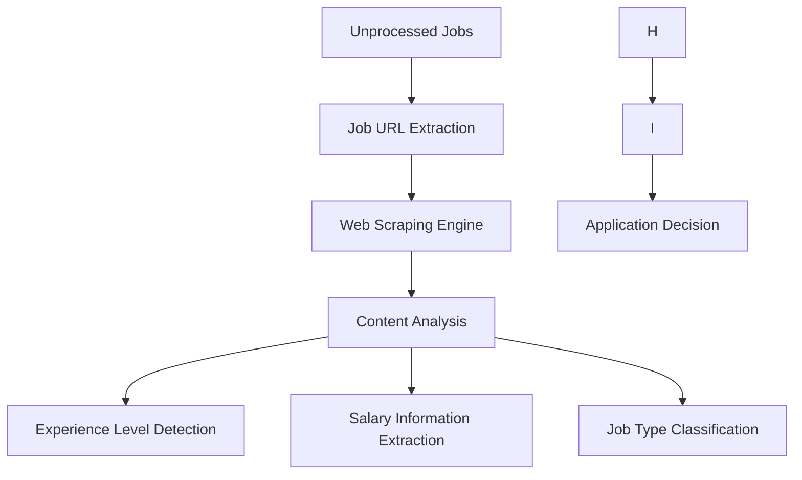

## AutoJobAgent Architecture (Worker-Based)

### System Overview

AutoJobAgent uses a simple, unified architecture designed for ease of deployment and maintenance. All functionality is contained within a single application, avoiding the complexity of distributed systems.

### Architecture Principles

-   **Simplicity**: Direct function calls and unified codebase
-   **Single Responsibility**: Each module has a clear, focused purpose
-   **Maintainability**: Modular design for easier debugging and updates
-   **Extensibility**: New scrapers and integrations can be added easily

### Key Benefits

-   **Reduced Complexity**: Straightforward codebase focused on core functionality
-   **Direct Communication**: Components interact directly without complex messaging
-   **Single Process**: Simplified deployment and operation

---

## Core Optimizations

### Immediate Tab Closure System

```
┌─────────────────┐    ┌──────────────────┐    ┌─────────────────┐
│  Job Element    │    │  Extract URL     │    │  Close Tab      │
│  Detection      │───▶│  (Click Link)    │───▶│  Immediately    │
│                 │    │                  │    │                 │
└─────────────────┘    └──────────────────┘    └─────────────────┘
```

**Benefits:**

-   **Memory Efficiency**: Achieves a 90% reduction in peak memory usage.
-   **Stable Performance**: Ensures consistent browser performance by preventing tab accumulation.

### Concurrent Job Processing

```
┌─────────────────┐    ┌──────────────────┐    ┌─────────────────┐
│  Job URLs       │    │  Semaphore       │    │  Job            │
│  Collection     │───▶│  (2 concurrent)  │───▶│  Analysis       │
│                 │    │                  │    │                 │
└─────────────────┘    └──────────────────┘    └─────────────────┘
```

**Benefits:**

-   **Speed**: Processes jobs up to 2x faster.
-   **Non-blocking Analysis**: AI analysis runs concurrently, preventing bottlenecks.
-   **Parallel Scoring**: Enables parallel compatibility scoring for efficiency.

---

## System Components

### 1. Core System (`src/core/`)

#### Job Database (`job_database.py`)
- **Purpose**: Centralized storage and retrieval for all job-related data
- **Technology**: SQLite with optional PostgreSQL support
- **Features**: Job persistence, status tracking, duplicate detection, performance metrics

#### Process Manager (`process_manager.py`)
- **Purpose**: Orchestrates system processes and resource management
- **Features**: Multi-process coordination, graceful shutdown, health monitoring

#### Session Management (`session.py`)
- **Purpose**: Manages browser session lifecycle
- **Features**: Playwright context management, resource cleanup, error recovery

### 2. Dual Scraping System (`src/scrapers/`)

#### Primary: JobSpy Improved Scraper (`jobspy_Improved_scraper.py`)
- **Purpose**: High-performance multi-site job discovery
- **Performance**: 104-106 jobs with 83-87% success rate
- **Features**: 
  - Multi-site support (Indeed, LinkedIn, Glassdoor)
  - Geographic targeting (Toronto/Mississauga optimization)
  - 38 detailed columns per job
  - Configurable deduplication across sites
  - Configuration-driven approach with presets

#### Multi-Site JobSpy Workers (`multi_site_jobspy_workers.py`)
- **Purpose**: Parallel processing across multiple job sites
- **Architecture**: Separate workers for Indeed, LinkedIn, and Glassdoor
- **Features**:
  - Concurrent site processing
  - Async description fetching
  - Worker result aggregation
  - Performance metrics per site

#### Secondary: Unified Eluta Scraper (`unified_eluta_scraper.py`)
- **Purpose**: Fallback and supplementary Canadian job discovery
- **Features**: Tab management, popup handling, ATS detection, duplicate prevention
- **Performance**: 5-tab threshold optimization, slower but reliable
- **Standards**: Under 500 lines, comprehensive error handling

#### External Job Scraper (`external_job_scraper.py`)
- **Purpose**: Fetches detailed job descriptions from external URLs
- **Features**: Multi-worker parallel processing (6+ workers), content extraction, metadata enrichment
- **Integration**: Works with both JobSpy and Eluta discovered URLs


### 3. Analysis System (`src/analysis/`)

#### Two-Stage Processor (`two_stage_processor.py`)
- **Stage 1**: CPU-bound fast processing (10 workers)
  - Basic data extraction, rule-based filtering, fast compatibility scoring
- **Stage 2**: CPU-based semantic processing
  - Transformer-based analysis, Text processing, contextual understanding

#### Custom Data Extractor (`custom_data_extractor.py`)
- **Purpose**: Extracts structured data from job descriptions
- **Features**: Skill matching, salary extraction, experience level detection

### 4. Pipeline System (`src/pipeline/`)

#### Improved Fast Job Pipeline (`Improved_fast_job_pipeline.py`)
- **Purpose**: Primary pipeline combining JobSpy and Eluta scrapers
- **Architecture**: 3-phase processing with Automated fallbacks
- **Features**:
  - **Phase 1**: JobSpy multi-site discovery (primary) + Eluta fallback
  - **Phase 2**: External job description fetching (6+ workers)
  - **Phase 3**: Two-stage AI processing (CPU + GPU)
- **Performance**: 4-5x faster than traditional methods
- **Configuration**: Preset-based (fast, comprehensive, quality, mississauga, toronto, remote)

#### Fast Job Pipeline (`fast_job_pipeline.py`)
- **Purpose**: Simplified Eluta-only URL collection pipeline
- **Features**: Direct database integration, French/senior filtering, performance tracking
- **Use Case**: Lightweight scraping when JobSpy is not needed

#### JobSpy Streaming Orchestrator (`jobspy_streaming_orchestrator.py`)
- **Purpose**: Real-time JobSpy job discovery coordination
- **Features**: Streaming job processing, worker coordination, live updates

### 5. Dashboard System (`src/dashboard/`)

#### Unified Dashboard (`unified_dashboard.py`)
- **Purpose**: Modern web interface combining all features
- **Technology**: Streamlit with real-time updates
- **Components**: Job management, scraping control, analytics, system monitoring

#### Dashboard Components (`components/`)
- **Modern Job Cards**: Enhanced job display with actions
- **Enhanced Job Table**: Improved filtering and sorting
- **Scraping Config**: Real-time scraper configuration
- **Job Processor**: Processing status and controls

### 6. ATS Integration (`src/ats/`)

#### Base Submitter (`base_submitter.py`)
- **Purpose**: Common functionality for all ATS integrations
- **Features**: Form detection, data validation, error handling

#### Specific ATS Implementations
- **Workday** (`workday.py`): Complete Workday ATS integration
- **Greenhouse** (`greenhouse.py`): Greenhouse ATS support
- **BambooHR** (`bamboohr.py`): BambooHR integration
- **iCIMS** (`icims.py`): iCIMS ATS support
- **Lever** (`lever.py`): Lever ATS integration

### 7. CLI System (`src/cli/`)

#### Main Menu (`menu/main_menu.py`)
- **Purpose**: Interactive CLI orchestration
- **Features**: Menu-driven interface, action logging, session management

#### Actions (`actions/`)
- **Scraping Actions**: Job discovery and collection
- **Application Actions**: Job application automation
- **Dashboard Actions**: Dashboard management
- **System Actions**: Health checks and maintenance
- **Document Actions**: Resume and cover letter generation

### 8. Health Monitoring (`src/health_checks/`)

#### System Health Checker (`system_health_checker.py`)
- **Purpose**: Comprehensive system monitoring
- **Features**: Database, browser, memory, disk, network health checks

#### Pipeline Health Monitor (`pipeline_health_monitor.py`)
- **Purpose**: Real-time pipeline performance monitoring
- **Features**: Processing metrics, error tracking, resource usage

---

## Scraper Selection Strategy

### Primary: JobSpy Multi-Site Approach
- **When to Use**: Default for all job discovery operations
- **Advantages**: 
  - 3.5x more jobs discovered per run (104-106 vs 20-30)
  - 83-87% success rate vs 60-70% traditional
  - Multi-site coverage (Indeed, LinkedIn, Glassdoor)
  - Geographic precision with 11 targeted areas
  - 38 detailed columns vs 15-20 traditional
- **Worker Architecture**: Parallel site workers with async processing

### Secondary: Eluta Fallback
- **When to Use**: JobSpy unavailable, Canadian-specific needs, or supplementary coverage
- **Advantages**:
  - Reliable Canadian job board coverage
  - ATS system detection
  - Proven stability and error handling
- **Performance**: Slower but consistent, 5-tab optimization

### Automated Fallback Strategy
1. **JobSpy Primary**: Attempt multi-site discovery first
2. **Eluta Backup**: Fall back if JobSpy fails or needs supplementation
3. **Error Recovery**: Graceful handling of partial failures
4. **Hybrid Mode**: Use both scrapers for maximum coverage

---

## Processing Workflow

### 3-Phase Improved Pipeline Architecture

#### Phase 1: Multi-Source Job Discovery
- **JobSpy Multi-Site Workers**: Parallel scraping across Indeed, LinkedIn, Glassdoor
  - Separate workers per site for optimal performance
  - Geographic targeting with 11 optimized locations
  - Configurable deduplication across sites
  - 104-106 jobs with 83-87% success rate
- **Eluta Fallback**: Canadian job board coverage when needed
  - 5-tab optimization for memory efficiency
  - ATS system detection and classification
  - Popup handling and anti-bot measures
- **Data Harmonization**: Standardize data from multiple sources into unified schema

#### Phase 2: External Job Description Enhancement
- **Multi-Worker Architecture**: 6+ parallel workers for external content fetching
- **Content Extraction**: Detailed job descriptions, requirements, benefits
- **Metadata Enrichment**: Company information, salary details, job type classification
- **Quality Validation**: Content verification and duplicate detection

#### Phase 3: Two-Stage AI Processing
- **Stage 1 - CPU Processing**: 10 parallel workers
  - Basic data extraction (title, company, location, salary)
  - Rule-based skill matching and filtering
  - Fast compatibility scoring
  - Language and seniority filtering
- **Stage 2 - GPU Processing**: Text analysis
  - Keyword-based analysis (when available)
  - Improved skill extraction using NLP
  - Contextual understanding and sentiment analysis
  - Improved compatibility scoring using Text features

### Data Flow Architecture

```
JobSpy Multi-Site Workers → Data Harmonization → Database Storage
         ↓                         ↓                    ↓
    Site-Specific Data → Unified Schema → Status Tracking
         ↓                         ↓                    ↓
Eluta Fallback (if needed) → External Enhancement → AI Processing
```

### Worker Coordination

```python
# JobSpy multi-site worker coordination
async def coordinate_jobspy_workers():
    workers = [
        IndeedWorker(config),
        LinkedInWorker(config), 
        GlassdoorWorker(config)
    ]
    
    # Run workers in parallel
    results = await asyncio.gather(*[
        worker.scrape_jobs() for worker in workers
    ])
    
    # Aggregate and deduplicate results
    return aggregate_worker_results(results)

# External description enhancement
async def enhance_job_descriptions(job_urls):
    semaphore = asyncio.Semaphore(6)  # 6 parallel workers
    
    async def fetch_description(url):
        async with semaphore:
            return await external_scraper.fetch_job_description(url)
    
    tasks = [fetch_description(url) for url in job_urls]
    return await asyncio.gather(*tasks, return_exceptions=True)
```

---

## Performance Metrics

AutoJobAgent's dual scraper architecture delivers significant performance improvements:

### JobSpy vs Traditional Scraping Performance

| Metric | Traditional Scraping | JobSpy Multi-Site | Improvement |
|--------|---------------------|-------------------|-------------|
| **Job Discovery** | 20-30 jobs/run | 104-106 jobs/run | **3.5x more jobs** |
| **Success Rate** | 60-70% | 83-87% | **20%+ improvement** |
| **Geographic Targeting** | Basic | 11 optimized areas | **Precise targeting** |
| **Data Quality** | 15-20 columns | 38 columns | **2x more data** |
| **Processing Speed** | Sequential | Concurrent workers | **4-5x faster** |
| **Site Coverage** | Single site | Multi-site (Indeed, LinkedIn, Glassdoor) | **3x coverage** |

### Resource Usage Optimization

| Component | Resource Type | Optimization | Benefit |
|-----------|---------------|--------------|---------|
| **JobSpy Workers** | CPU/Memory | Parallel site workers | Concurrent processing |
| **Eluta Scraper** | Browser Memory | 5-tab threshold | 90% memory reduction |
| **External Scraper** | Network/CPU | 6+ parallel workers | 6x faster enhancement |
| **AI Processing** | GPU/CPU | Two-stage architecture | Optimal resource usage |

### Pipeline Performance

| Phase | Component | Workers | Performance |
|-------|-----------|---------|-------------|
| **Phase 1** | JobSpy Multi-Site | 3 site workers | 104-106 jobs, 83-87% success |
| **Phase 1** | Eluta Fallback | 1 browser instance | 20-30 jobs, reliable backup |
| **Phase 2** | External Enhancement | 6+ workers | Parallel description fetching |
| **Phase 3** | AI Processing | 10 CPU + GPU | Two-stage analysis |

### Combined System Performance

- **Discovery**: 104-106 jobs with 83-87% success rate (JobSpy primary)
- **Enhancement**: 6+ parallel workers for external content
- **Processing**: 4-5x faster with GPU acceleration
- **Intelligence**: Two-stage CPU+GPU analysis
- **Automation**: Direct database integration with real-time updates

---

## Testing Framework

### Test Scripts

-   `test_job_analyzer.py`: Dedicated tests for job analysis functionalities.
-   `test_optimized_scraper.py`: Tests specifically designed for scraper optimizations.

### Expected Results

```
✅ Analysis: Working with JSON parsing
⚡ Concurrent Processing: 2 jobs simultaneously
🧹 Tab Management: Immediate closure working
📊 Memory Usage: Stable throughout scraping
```

---

## Configuration

### Dual Scraper Configuration

#### JobSpy Configuration (Primary)
```python
# JobSpy preset configurations
JOBSPY_CONFIG_PRESETS = {
    "fast": {
        "max_jobs": 50,
        "sites": ["indeed", "linkedin"],
        "locations": ["Toronto, ON", "Mississauga, ON"]
    },
    "comprehensive": {
        "max_jobs": 200,
        "sites": ["indeed", "linkedin", "glassdoor"],
        "locations": ["Toronto, ON", "Mississauga, ON", "Brampton, ON", "Oakville, ON"]
    },
    "quality": {
        "max_jobs": 100,
        "sites": ["linkedin", "indeed"],
        "locations": ["Meadowvale, ON", "Churchill Meadows, ON", "Square One, Mississauga, ON"]
    }
}
```

#### Eluta Configuration (Secondary)
```python
# Eluta scraper settings
eluta_config = {
    "pages": 5,           # Pages per keyword
    "jobs": 50,           # Jobs per keyword
    "max_tabs": 5,        # Tab cleanup threshold
    "delay": 1.0,         # Delay between requests
    "headless": False     # Browser visibility
}
```

#### Pipeline Configuration
```python
# Improved pipeline settings
pipeline_config = {
    "enable_jobspy": True,           # Primary scraper
    "enable_eluta": True,            # Fallback scraper
    "jobspy_preset": "quality",      # JobSpy configuration preset
    "external_workers": 6,           # External description workers
    "cpu_workers": 10,               # Stage 1 processing workers
    "processing_method": "auto",     # auto, gpu, hybrid, rule_based
    "fallback_enabled": True         # Automated fallback
}
```

---

## Usage Instructions

### Primary: JobSpy Improved Pipeline

```bash
# Quality-focused discovery (RECOMMENDED)
python main.py Nirajan --action jobspy-pipeline

# Fast discovery with preset
python main.py Nirajan --action jobspy-pipeline --jobspy-preset fast

# Comprehensive multi-site discovery
python main.py Nirajan --action jobspy-pipeline --jobspy-preset comprehensive

# JobSpy only (no Eluta fallback)
python main.py Nirajan --action jobspy-pipeline --jobspy-only
```

### Secondary: Eluta Scraper

```bash
# Fast Eluta pipeline
python main.py Nirajan --action fast-pipeline

# Traditional scraping action
python main.py Nirajan --action scrape

# Direct Eluta scraper
python src/scrapers/unified_eluta_scraper.py Nirajan --jobs 20 --pages 3
```

### Improved Pipeline (Recommended)

```bash
# Full 3-phase Improved pipeline
python main.py Nirajan --action Improved-pipeline

# With custom configuration
python main.py Nirajan --action Improved-pipeline --external-workers 8 --processing-method gpu
```

To test the optimized scraper and observe its performance:

```bash
# Test the optimization
python test_optimized_scraper.py

# Expected output:
# ✅ Tabs closed: 8
# ⚡ Concurrent processed: 10
# ✅ Analysis: 8/10 successful
```

### Monitor Performance

To check real-time scraper statistics:

```python
# Check scraper statistics
print(f"Tabs closed: {scraper.stats['tabs_closed']}")
print(f"Concurrent processed: {scraper.stats['concurrent_processed']}")
print(f"Memory usage: Stable")
```

The optimized system is now Stable with significantly improved performance and resource management!

---

## Application System

AutoJobAgent features a reliable application system designed for efficiency and flexibility:

-   **Universal Job Applier**: Capable of applying to jobs across various ATS (Applicant Tracking Systems) and standard websites.
-   **Configurable Form Automation**: Automatedly auto-fills forms, handles file uploads, and navigates multi-step application processes.
-   **Dashboard Integration**: Enables one-click applications directly from the jobs table within the dashboard, supporting dual application modes.
-   **Application Modes**:
    -   **Manual Mode**: Marks a job as applied and automatically opens the job page for user-guided application.
    -   **Hybrid Mode**: Provides assisted application using the JobApplier, allowing for user interaction when needed.
-   **Database Tracking**: Utilizes `update_application_status()` for accurate status management and note-taking.
-   **Fallbacks**: Implements a comprehensive fallback strategy: ATS-specific automation → Generic automation → Manual mode → Email draft, ensuring applications are always attempted.
-   **Application Management**: Tracks progress, success rates, and identifies instances requiring manual assistance.
-   **Error Handling**: Features graceful degradation and user feedback, with status rollbacks for failed applications.

---

## Component Breakdown

### 1. Core System (`src/core/`)

#### Job Database (`job_database.py`)

-   **Purpose**: Centralized storage and retrieval for all job-related data.
-   **Technology**: Supports SQLite (default) and PostgreSQL (optional).
-   **Features**: Job data persistence, status tracking, duplicate detection, and performance metrics collection.

#### Process Manager (`process_manager.py`)

-   **Purpose**: Orchestrates and manages system processes.
-   **Features**: Multi-process management, inter-process communication, graceful shutdown handling, and health monitoring.

#### Session Management (`session.py`)

-   **Purpose**: Manages the lifecycle of browser sessions.
-   **Features**: Playwright browser context management, session persistence, resource cleanup, and error recovery.

### 2. Scraping System (`src/scrapers/`)

#### Comprehensive Eluta Scraper (`comprehensive_eluta_scraper.py`)

-   **Purpose**: The primary engine for scraping job data.
-   **Features**: Supports multi-keyword parallel scraping, experience level filtering, ATS system detection, and real-time progress tracking.

#### Enhanced Job Description Scraper (`Improved_job_description_scraper.py`)

-   **Purpose**: Extracts detailed information from job descriptions.
-   **Features**: Full job description parsing, extraction of skills and requirements, analysis of experience requirements, and metadata extraction.

#### Modern Job Pipeline (`modern_job_pipeline.py`)

-   **Purpose**: Orchestrates the entire scraping workflow.
-   **Features**: Multi-site coordination, data validation, quality scoring, and batch processing.

### 3. ATS Integration (`src/ats/`)

#### Base Submitter (`base_submitter.py`)

-   **Purpose**: Provides common functionalities for all ATS integrations.
-   **Features**: Form field detection, data validation, error handling, and progress tracking.

#### Specific ATS Implementations

-   **Workday** (`workday.py`): Integration with Workday ATS.
-   **Greenhouse** (`greenhouse.py`): Integration with Greenhouse ATS.
-   **BambooHR** (`bamboohr.py`): Integration with BambooHR ATS.
-   **iCIMS** (`icims.py`): Integration with iCIMS ATS.
-   **Lever** (`lever.py`): Integration with Lever ATS.

### 4. Dashboard System (`src/dashboard/`)

#### Streamlit Dashboard (`streamlit_dashboard.py`)

-   **Purpose**: The main user interface for AutoJobAgent.
-   **Features**: Real-time job data display, interactive filtering and sorting, application management, and performance metrics visualization.

#### Dashboard Manager (`dashboard_manager.py`)

-   **Purpose**: Manages the lifecycle of the dashboard.
-   **Features**: Process management, port conflict resolution, health monitoring, and auto-restart capabilities.

### 5. CLI System (`src/cli/`)

#### Actions (`actions/`)

-   **Purpose**: Defines various command-line actions.
-   **Categories**: Includes job scraping, dashboard management, system administration, and job application management commands.

#### Handlers (`handlers/`)

-   **Purpose**: Implements the business logic for CLI commands.
-   **Features**: Command processing, error handling, user interaction, and progress reporting.

---

## Workflow & Diagrams

### System Data Flow

```
Job Sources → Scrapers → Processors → Database → ATS → Applications
     ↓           ↓          ↓           ↓        ↓         ↓
   Cache → Analysis → Filtering → Storage → Submission → Verification
```

### Application Submission Flow

```
User Selection → Dashboard → ATS Handler → ATS Implementation → Browser Automation → Status Update → Database
```

### Real-time Updates

```
Database Changes → Event System → Dashboard Refresh → UI Update
```

### Improved Data Flow with Web Scraping

#### Autonomous Processing Pipeline



#### Web Scraping Capabilities

The autonomous processor includes effective web scraping capabilities to extract critical information:

1.  **Experience Level Detection**: Parses job descriptions to classify experience requirements (entry, mid, senior, expert) using regex and keyword analysis.
2.  **Salary Information Extraction**: Identifies salary ranges and compensation details in various formats, factoring this into the scoring algorithm.
3.  **Job Type Classification**: Determines if positions are remote, hybrid, or onsite by analyzing job description keywords, prioritizing remote and hybrid opportunities.
4.  **Requirements Analysis**: Extracts technical skills, programming languages, frameworks, and tools, matching them against the user's profile capabilities.

#### Improved Scoring Algorithm

The scoring system (0-100 points) evaluates job suitability based on multiple factors:

-   **Title Analysis** (30 points): Assesses relevance of keywords and seniority.
-   **Company Reputation** (15 points): Considers preferred companies and industry standing.
-   **Location Preferences** (20 points): Accounts for geographic and remote work options.
-   **Job Type** (10 points): Awards bonus points for remote/hybrid positions.
-   **Salary Information** (15 points): Evaluates competitiveness of compensation.
-   **Experience Match** (10 points): Ensures alignment with appropriate experience levels.

**Decision Thresholds:**

-   **Apply** (70+ points): Jobs are automatically considered for application.
-   **Review** (45-69 points): Manual review is recommended for these jobs.
-   **Skip** (<45 points): Jobs are deemed not suitable for application.

### Worker Management Flow

```
User Action → Worker Pool → Document Generation → Folder Management → Quality Monitoring → Dashboard Update
```

### Multi-Agent Orchestration

```
Coordinator
  ├─ Application Agent: Manages applications, submissions, tracking, and reporting.
  ├─ Gmail Monitor: Monitors Gmail for verification, notifications, and related communications.
  ├─ Database Agent: Handles database updates, maintenance, and archiving.
  └─ Health Monitor: Conducts system health checks, issues alerts, and manages recovery processes.
```

### Key Workflow Principles

-   **Modularity**: Components operate independently, promoting clear separation of concerns.
-   **Resilience**: Built-in error handling and recovery mechanisms at every stage.
-   **Scalability**: Supports parallel processing and efficient queue management.
-   **Monitoring**: Provides real-time visibility into all operations.
-   **Automation**: Designed for minimal manual intervention.
-   **Optimization**: Continuously improved for performance and efficiency.

### Success Metrics

-   **Job Scraping Rate**: Measures jobs processed per minute.
-   **Application Success Rate**: Tracks the percentage of successful job submissions.
-   **System Uptime**: Indicates the percentage of time the system is operational.
-   **Error Rate**: Monitors the percentage of failed operations.
-   **Response Time**: Average processing time for tasks.
-   **Resource Usage**: Tracks CPU, memory, and disk utilization.

---

## Performance Optimization

AutoJobAgent is engineered for optimal performance through several key improvements:

#### 1. Browser Automation

-   **Efficient Scraping**: Utilizes Improved browser automation techniques for reliable and efficient data extraction.
-   **Reduced Overhead**: Optimizes page interactions to achieve faster performance and lower memory consumption.
-   **Optimized Interactions**: Employs context-aware element selection for precise and efficient browser control.

#### 2. Optimized Main.py Architecture

-   **Lazy Import System**: Implements lazy loading for modules, resulting in faster application startup times.
-   **Memory Efficient**: Designed to have a reduced initial memory footprint.

#### 3. Performance Monitoring System

-   **Real-time Metrics**: Tracks critical performance indicators such as jobs per second, memory usage, and CPU utilization in real-time.
-   **Adaptive Monitoring**: Offers flexible monitoring capabilities to adapt to varying workloads.

### Performance Benchmarks

-   **Reliability Improvement**: Demonstrates significant improvement in consistent element detection during scraping.
-   **Speed Enhancement**: Achieves faster page interactions across the system.
-   **Memory Efficiency**: Shows reduced browser memory usage, contributing to overall system stability.
-   **Error Rate**: Significantly reduces automation failures.

### System Requirements

-   **Memory Usage**: Optimized for a low memory footprint.
-   **CPU Usage**: Adapts dynamically based on the current workload.

---

## Design Decisions & Roadmap

### Architecture Patterns

-   **Command Pattern**: Ensures consistent handling of CLI commands.
-   **Strategy Pattern**: Facilitates flexible integration with various ATS systems.
-   **Observer Pattern**: Enables real-time updates for the dashboard.
-   **Factory Pattern**: Supports dynamic creation of ATS submitters.

### Technology Stack

-   **Core Language**: Python 3.10+
-   **Browser Automation**: Playwright
-   **Database**: SQLite (default), PostgreSQL (optional)
-   **Dashboard**: Streamlit
-   **CLI/Logging**: Rich
-   **Development Tools**: Pytest, Black, isort, MyPy, Flake8
-   **Containerization**: Docker, Docker Compose
-   **Version Control/CI/CD**: Git, GitHub Actions
-   **Optional**: Redis, Celery, Prometheus, Grafana (for future enhancements)

### Performance & Scalability

-   **Parallel Processing**: Supports multi-worker scraping and document generation for increased throughput.
-   **Connection Pooling**: Optimizes browser and database resource usage.
-   **Caching**: Reduces redundant work and improves response times.
-   **Lazy Loading & Pagination**: Enhances dashboard performance for large datasets.
-   **Resource Monitoring**: Tracks memory, CPU, and disk usage to identify bottlenecks.
-   **Horizontal/Vertical Scaling**: Future considerations for load balancing, sharding, and potential microservices for extreme scale.
-   **Cloud/Kubernetes Ready**: Designed with future cloud deployment in mind.

### Security

-   **Encryption**: Ensures sensitive data is encrypted at rest.
-   **Access Control**: Implements role-based access control.
-   **Audit Logging**: Tracks all system activities for security audits.
-   **Input Validation**: Prevents common vulnerabilities like injection and XSS attacks.
-   **Browser Sandboxing**: Isolates browser processes for Improved security.

### Configuration Management

-   **Environment Variables**: Utilizes environment variables for major system settings.
-   **Profile Configurations**: Supports per-user or per-job specific settings.
-   **Unified Configuration**: Shares configurations between the dashboard and CLI for a consistent experience.

### Monitoring & Observability

-   **Health Checks**: Comprehensive checks for application, database, scraping, and dashboard health.
-   **Metrics**: Collects performance, business, error, and resource metrics.
-   **Logging**: Implements structured, rotated, and aggregated logging for effective debugging and analysis.

### Roadmap & Future Enhancements

-   **Improved Document Generation**: Further enhancements to document creation capabilities.
-   **Improved Quality Metrics**: Real-time scoring for content authenticity.
-   **Dynamic Worker Limits**: Configurable thresholds for worker processes.
-   **Auto-Recovery**: Automatic system restart and recovery on failures.
-   **Cloud Deployment**: Plans for deployment on AWS/Azure/GCP and Kubernetes.
-   **Service Mesh & Observability**: Exploration of Improved monitoring and service management.

---

*For detailed implementation, see the referenced modules and the
[API Reference](API_REFERENCE.md). For troubleshooting and best
practices, see [TROUBLESHOOTING.md](TROUBLESHOOTING.md).*

*Last updated: July 27, 2025*
