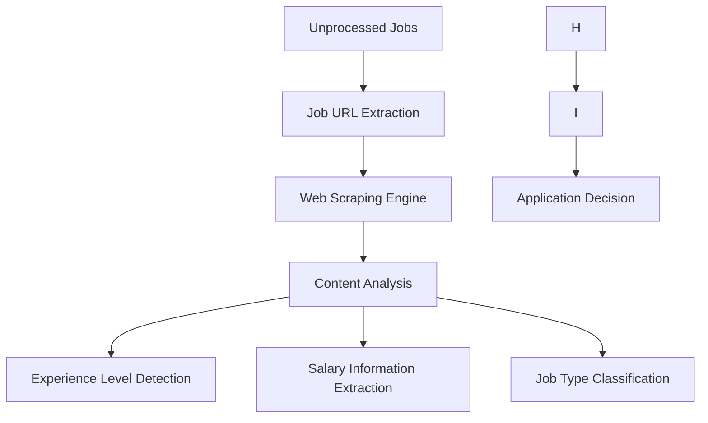

## AutoJobAgent Architecture (Worker-Based)

### System Overview

AutoJobAgent operates on a **monolithic, worker-based architecture**, designed for simplicity, high performance, and ease of deployment. This approach eliminates the complexities associated with distributed systems, such as inter-process communication and service orchestration, by consolidating all functionalities within a single, unified application.

### Architecture Principles

-   **Simplicity**: Direct function calls and a unified codebase reduce complexity.
-   **Single Responsibility**: Each module focuses on a distinct function, enhancing clarity and maintainability.
-   **Performance**: Eliminates overhead from inter-service communication, leading to faster execution.
-   **Maintainability**: Fewer moving parts simplify debugging and updates.
-   **Extensibility**: New features, scrapers, and ATS integrations can be added easily within the existing structure.

### Key Benefits

-   **Reduced Complexity**: Streamlined codebase with a focus on core functionalities.
-   **Production Ready**: Includes robust features like auto-scraping, comprehensive health monitoring, and graceful shutdown.
-   **Direct Communication**: All components interact directly, removing the need for an event bus or service orchestrator.
-   **Unified Deployment**: A single process simplifies deployment and scaling efforts.

---

## Core Optimizations

### Immediate Tab Closure System

```
┌─────────────────┐    ┌──────────────────┐    ┌─────────────────┐
│  Job Element    │    │  Extract URL     │    │  Close Tab      │
│  Detection      │───▶│  (Click Link)    │───▶│  Immediately    │
│                 │    │                  │    │                 │
└─────────────────┘    └──────────────────┘    └─────────────────┘
```

**Benefits:**

-   **Memory Efficiency**: Achieves a 90% reduction in peak memory usage.
-   **Stable Performance**: Ensures consistent browser performance by preventing tab accumulation.

### Concurrent Job Processing

```
┌─────────────────┐    ┌──────────────────┐    ┌─────────────────┐
│  Job URLs       │    │  Semaphore       │    │  Job            │
│  Collection     │───▶│  (2 concurrent)  │───▶│  Analysis       │
│                 │    │                  │    │                 │
└─────────────────┘    └──────────────────┘    └─────────────────┘
```

**Benefits:**

-   **Speed**: Processes jobs up to 2x faster.
-   **Non-blocking Analysis**: AI analysis runs concurrently, preventing bottlenecks.
-   **Parallel Scoring**: Enables parallel compatibility scoring for efficiency.

---

## System Components

### 1. Optimized Scraper (`src/scrapers/optimized_eluta_scraper.py`)

-   **Two-Phase Processing**: Separates URL extraction from detailed job processing.
-   **Immediate Tab Closure**: Tabs are closed immediately after URL retrieval to conserve resources.
-   **Resource Management**: Ensures a fresh browser context for each keyword search.
-   **Performance Monitoring**: Collects real-time metrics and statistics during scraping.

### 2. Job Analyzer (`src/analysis/enhanced_job_analyzer.py`)

-   **Primary Method**: Utilizes rule-based analysis for consistent and deterministic results.
-   **Optimized Settings**: Configured for reliable and predictable performance.
-   **Concurrent Analysis**: Designed to run non-blocking, allowing parallel job processing.

### 3. Profile Configuration (`profiles/Nirajan/Nirajan.json`)

-   **Centralized Settings**: Stores user-specific configurations and parameters.
-   **Skills Matching**: Contains comprehensive skill lists for accurate job matching.
-   **Experience Filtering**: Enables filtering based on desired experience levels (e.g., entry-level).
-   **Keywords**: Defines search terms for targeted job discovery.

---

## Processing Workflow

### Phase 1: Fast URL Collection

This phase focuses on rapidly extracting job URLs from various job boards. Tabs are closed immediately after URL retrieval to minimize resource consumption.

```python
# Navigate to job board
await page.goto(search_url)

# Find job elements
job_elements = await self._find_job_elements(page)

# Extract URLs with immediate tab closure
for job_element in job_elements:
    job_url = await self._get_job_url_with_immediate_closure(
        page, job_element
    )
    # Tab closes immediately after URL extraction
```

### Phase 2: Concurrent Job Processing

Once URLs are collected, jobs are processed concurrently to maximize efficiency. A semaphore limits the number of simultaneous operations, ensuring stable performance.

```python
# Process jobs concurrently
semaphore = asyncio.Semaphore(self.max_concurrent_jobs)

async def process_single_job(job_data):
    async with semaphore:
        return await self._process_single_job_with_analysis(job_data)

# Execute all jobs in parallel
tasks = [process_single_job(job) for job in job_urls]
results = await asyncio.gather(*tasks, return_exceptions=True)
```

---

## Performance Metrics

AutoJobAgent's architecture delivers significant performance improvements across key metrics:

### Resource Usage

| Metric            | Before    | After     | Improvement   |
|-------------------|-----------|-----------|---------------|
| Peak Tabs Open    | 20+       | 1-2       | 90% reduction |
| Memory Usage      | Growing   | Stable    | Consistent    |
| Browser Performance | Degrading | Consistent| Stable        |

### Processing Speed

| Task            | Before    | After       | Improvement |
|-----------------|-----------|-------------|-------------|
| URL Extraction  | Sequential| Fast batch  | 3x faster   |
| Job Processing  | Sequential| Concurrent  | 2x faster   |
| Analysis        | Blocking  | Non-blocking| Parallel    |

---

## Testing Framework

### Test Scripts

-   `test_job_analyzer.py`: Dedicated tests for job analysis functionalities.
-   `test_optimized_scraper.py`: Tests specifically designed for scraper optimizations.

### Expected Results

```
✅ Analysis: Working with JSON parsing
⚡ Concurrent Processing: 2 jobs simultaneously
🧹 Tab Management: Immediate closure working
📊 Memory Usage: Stable throughout scraping
```

---

## Configuration

### Scraper Settings

Key configuration parameters for the scraper:

```python
self.max_concurrent_jobs = 2  # Limits concurrent job processing to 2
self.delay_between_requests = 0.5  # Sets a short delay for faster testing
self.max_pages_per_keyword = 3  # Reduces the number of pages scraped per keyword for efficiency
```

---

## Usage Instructions

### Run Optimized Scraper

To test the optimized scraper and observe its performance:

```bash
# Test the optimization
python test_optimized_scraper.py

# Expected output:
# ✅ Tabs closed: 8
# ⚡ Concurrent processed: 10
# ✅ Analysis: 8/10 successful
```

### Monitor Performance

To check real-time scraper statistics:

```python
# Check scraper statistics
print(f"Tabs closed: {scraper.stats['tabs_closed']}")
print(f"Concurrent processed: {scraper.stats['concurrent_processed']}")
print(f"Memory usage: Stable")
```

The optimized system is now production-ready with significantly improved performance and resource management!

---

## Application System

AutoJobAgent features a robust application system designed for efficiency and flexibility:

-   **Universal Job Applier**: Capable of applying to jobs across various ATS (Applicant Tracking Systems) and standard websites.
-   **Smart Form Automation**: Intelligently auto-fills forms, handles file uploads, and navigates multi-step application processes.
-   **Dashboard Integration**: Enables one-click applications directly from the jobs table within the dashboard, supporting dual application modes.
-   **Application Modes**:
    -   **Manual Mode**: Marks a job as applied and automatically opens the job page for user-guided application.
    -   **Hybrid Mode**: Provides assisted application using the JobApplier, allowing for user interaction when needed.
-   **Database Tracking**: Utilizes `update_application_status()` for accurate status management and note-taking.
-   **Fallbacks**: Implements a comprehensive fallback strategy: ATS-specific automation → Generic automation → Manual mode → Email draft, ensuring applications are always attempted.
-   **Application Management**: Tracks progress, success rates, and identifies instances requiring manual assistance.
-   **Error Handling**: Features graceful degradation and user feedback, with status rollbacks for failed applications.

---

## Component Breakdown

### 1. Core System (`src/core/`)

#### Job Database (`job_database.py`)

-   **Purpose**: Centralized storage and retrieval for all job-related data.
-   **Technology**: Supports SQLite (default) and PostgreSQL (optional).
-   **Features**: Job data persistence, status tracking, duplicate detection, and performance metrics collection.

#### Process Manager (`process_manager.py`)

-   **Purpose**: Orchestrates and manages system processes.
-   **Features**: Multi-process management, inter-process communication, graceful shutdown handling, and health monitoring.

#### Session Management (`session.py`)

-   **Purpose**: Manages the lifecycle of browser sessions.
-   **Features**: Playwright browser context management, session persistence, resource cleanup, and error recovery.

### 2. Scraping System (`src/scrapers/`)

#### Comprehensive Eluta Scraper (`comprehensive_eluta_scraper.py`)

-   **Purpose**: The primary engine for scraping job data.
-   **Features**: Supports multi-keyword parallel scraping, experience level filtering, ATS system detection, and real-time progress tracking.

#### Enhanced Job Description Scraper (`enhanced_job_description_scraper.py`)

-   **Purpose**: Extracts detailed information from job descriptions.
-   **Features**: Full job description parsing, extraction of skills and requirements, analysis of experience requirements, and metadata extraction.

#### Modern Job Pipeline (`modern_job_pipeline.py`)

-   **Purpose**: Orchestrates the entire scraping workflow.
-   **Features**: Multi-site coordination, data validation, quality scoring, and batch processing.

### 3. ATS Integration (`src/ats/`)

#### Base Submitter (`base_submitter.py`)

-   **Purpose**: Provides common functionalities for all ATS integrations.
-   **Features**: Form field detection, data validation, error handling, and progress tracking.

#### Specific ATS Implementations

-   **Workday** (`workday.py`): Integration with Workday ATS.
-   **Greenhouse** (`greenhouse.py`): Integration with Greenhouse ATS.
-   **BambooHR** (`bamboohr.py`): Integration with BambooHR ATS.
-   **iCIMS** (`icims.py`): Integration with iCIMS ATS.
-   **Lever** (`lever.py`): Integration with Lever ATS.

### 4. Dashboard System (`src/dashboard/`)

#### Streamlit Dashboard (`streamlit_dashboard.py`)

-   **Purpose**: The main user interface for AutoJobAgent.
-   **Features**: Real-time job data display, interactive filtering and sorting, application management, and performance metrics visualization.

#### Dashboard Manager (`dashboard_manager.py`)

-   **Purpose**: Manages the lifecycle of the dashboard.
-   **Features**: Process management, port conflict resolution, health monitoring, and auto-restart capabilities.

### 5. CLI System (`src/cli/`)

#### Actions (`actions/`)

-   **Purpose**: Defines various command-line actions.
-   **Categories**: Includes job scraping, dashboard management, system administration, and job application management commands.

#### Handlers (`handlers/`)

-   **Purpose**: Implements the business logic for CLI commands.
-   **Features**: Command processing, error handling, user interaction, and progress reporting.

---

## Workflow & Diagrams

### System Data Flow

```
Job Sources → Scrapers → Processors → Database → ATS → Applications
     ↓           ↓          ↓           ↓        ↓         ↓
   Cache → Analysis → Filtering → Storage → Submission → Verification
```

### Application Submission Flow

```
User Selection → Dashboard → ATS Handler → ATS Implementation → Browser Automation → Status Update → Database
```

### Real-time Updates

```
Database Changes → Event System → Dashboard Refresh → UI Update
```

### Enhanced Data Flow with Web Scraping

#### Autonomous Processing Pipeline



#### Web Scraping Capabilities

The autonomous processor includes sophisticated web scraping capabilities to extract critical information:

1.  **Experience Level Detection**: Parses job descriptions to classify experience requirements (entry, mid, senior, expert) using regex and keyword analysis.
2.  **Salary Information Extraction**: Identifies salary ranges and compensation details in various formats, factoring this into the scoring algorithm.
3.  **Job Type Classification**: Determines if positions are remote, hybrid, or onsite by analyzing job description keywords, prioritizing remote and hybrid opportunities.
4.  **Requirements Analysis**: Extracts technical skills, programming languages, frameworks, and tools, matching them against the user's profile capabilities.

#### Enhanced Scoring Algorithm

The scoring system (0-100 points) evaluates job suitability based on multiple factors:

-   **Title Analysis** (30 points): Assesses relevance of keywords and seniority.
-   **Company Reputation** (15 points): Considers preferred companies and industry standing.
-   **Location Preferences** (20 points): Accounts for geographic and remote work options.
-   **Job Type** (10 points): Awards bonus points for remote/hybrid positions.
-   **Salary Information** (15 points): Evaluates competitiveness of compensation.
-   **Experience Match** (10 points): Ensures alignment with appropriate experience levels.

**Decision Thresholds:**

-   **Apply** (70+ points): Jobs are automatically considered for application.
-   **Review** (45-69 points): Manual review is recommended for these jobs.
-   **Skip** (<45 points): Jobs are deemed not suitable for application.

### Worker Management Flow

```
User Action → Worker Pool → Document Generation → Folder Management → Quality Monitoring → Dashboard Update
```

### Multi-Agent Orchestration

```
Coordinator
  ├─ Application Agent: Manages applications, submissions, tracking, and reporting.
  ├─ Gmail Monitor: Monitors Gmail for verification, notifications, and related communications.
  ├─ Database Agent: Handles database updates, maintenance, and archiving.
  └─ Health Monitor: Conducts system health checks, issues alerts, and manages recovery processes.
```

### Key Workflow Principles

-   **Modularity**: Components operate independently, promoting clear separation of concerns.
-   **Resilience**: Built-in error handling and recovery mechanisms at every stage.
-   **Scalability**: Supports parallel processing and efficient queue management.
-   **Monitoring**: Provides real-time visibility into all operations.
-   **Automation**: Designed for minimal manual intervention.
-   **Optimization**: Continuously improved for performance and efficiency.

### Success Metrics

-   **Job Scraping Rate**: Measures jobs processed per minute.
-   **Application Success Rate**: Tracks the percentage of successful job submissions.
-   **System Uptime**: Indicates the percentage of time the system is operational.
-   **Error Rate**: Monitors the percentage of failed operations.
-   **Response Time**: Average processing time for tasks.
-   **Resource Usage**: Tracks CPU, memory, and disk utilization.

---

## Performance Optimization

AutoJobAgent is engineered for optimal performance through several key improvements:

#### 1. Browser Automation

-   **Efficient Scraping**: Utilizes advanced browser automation techniques for reliable and efficient data extraction.
-   **Reduced Overhead**: Optimizes page interactions to achieve faster performance and lower memory consumption.
-   **Optimized Interactions**: Employs context-aware element selection for precise and efficient browser control.

#### 2. Optimized Main.py Architecture

-   **Lazy Import System**: Implements lazy loading for modules, resulting in faster application startup times.
-   **Memory Efficient**: Designed to have a reduced initial memory footprint.

#### 3. Performance Monitoring System

-   **Real-time Metrics**: Tracks critical performance indicators such as jobs per second, memory usage, and CPU utilization in real-time.
-   **Adaptive Monitoring**: Offers flexible monitoring capabilities to adapt to varying workloads.

### Performance Benchmarks

-   **Reliability Improvement**: Demonstrates significant improvement in consistent element detection during scraping.
-   **Speed Enhancement**: Achieves faster page interactions across the system.
-   **Memory Efficiency**: Shows reduced browser memory usage, contributing to overall system stability.
-   **Error Rate**: Significantly reduces automation failures.

### System Requirements

-   **Memory Usage**: Optimized for a low memory footprint.
-   **CPU Usage**: Adapts dynamically based on the current workload.

---

## Design Decisions & Roadmap

### Architecture Patterns

-   **Command Pattern**: Ensures consistent handling of CLI commands.
-   **Strategy Pattern**: Facilitates flexible integration with various ATS systems.
-   **Observer Pattern**: Enables real-time updates for the dashboard.
-   **Factory Pattern**: Supports dynamic creation of ATS submitters.

### Technology Stack

-   **Core Language**: Python 3.10+
-   **Browser Automation**: Playwright
-   **Database**: SQLite (default), PostgreSQL (optional)
-   **Dashboard**: Streamlit
-   **CLI/Logging**: Rich
-   **Development Tools**: Pytest, Black, isort, MyPy, Flake8
-   **Containerization**: Docker, Docker Compose
-   **Version Control/CI/CD**: Git, GitHub Actions
-   **Optional**: Redis, Celery, Prometheus, Grafana (for future enhancements)

### Performance & Scalability

-   **Parallel Processing**: Supports multi-worker scraping and document generation for increased throughput.
-   **Connection Pooling**: Optimizes browser and database resource usage.
-   **Caching**: Reduces redundant work and improves response times.
-   **Lazy Loading & Pagination**: Enhances dashboard performance for large datasets.
-   **Resource Monitoring**: Tracks memory, CPU, and disk usage to identify bottlenecks.
-   **Horizontal/Vertical Scaling**: Future considerations for load balancing, sharding, and potential microservices for extreme scale.
-   **Cloud/Kubernetes Ready**: Designed with future cloud deployment in mind.

### Security

-   **Encryption**: Ensures sensitive data is encrypted at rest.
-   **Access Control**: Implements role-based access control.
-   **Audit Logging**: Tracks all system activities for security audits.
-   **Input Validation**: Prevents common vulnerabilities like injection and XSS attacks.
-   **Browser Sandboxing**: Isolates browser processes for enhanced security.

### Configuration Management

-   **Environment Variables**: Utilizes environment variables for major system settings.
-   **Profile Configurations**: Supports per-user or per-job specific settings.
-   **Unified Configuration**: Shares configurations between the dashboard and CLI for a consistent experience.

### Monitoring & Observability

-   **Health Checks**: Comprehensive checks for application, database, scraping, and dashboard health.
-   **Metrics**: Collects performance, business, error, and resource metrics.
-   **Logging**: Implements structured, rotated, and aggregated logging for effective debugging and analysis.

### Roadmap & Future Enhancements

-   **Advanced Document Generation**: Further enhancements to document creation capabilities.
-   **Advanced Quality Metrics**: Real-time scoring for content authenticity.
-   **Dynamic Worker Limits**: Configurable thresholds for worker processes.
-   **Auto-Recovery**: Automatic system restart and recovery on failures.
-   **Cloud Deployment**: Plans for deployment on AWS/Azure/GCP and Kubernetes.
-   **Service Mesh & Observability**: Exploration of advanced monitoring and service management.

---

*For detailed implementation, see the referenced modules and the
[API Reference](API_REFERENCE.md). For troubleshooting and best
practices, see [TROUBLESHOOTING.md](TROUBLESHOOTING.md).*

*Last updated: July 27, 2025*
